# Database Design Document — DeepMindQ

> **Last updated:** 2025-07-24  
> **Schema file:** `prisma/schema.prisma` (2,935 lines)  
> **Migration directory:** `prisma/migrations/`

---

## 1. Overview

| Property | Value |
|---|---|
| **ORM** | Prisma 6 (prisma-client-js generator) |
| **Database** | PostgreSQL 16 |
| **Connection** | Pool via `DATABASE_URL`; direct via `DIRECT_DATABASE_URL` |
| **Models** | 91 |
| **Relations** | 96 |
| **Enums** | 20 |
| **ID strategy** | `cuid()` (collision-resistant, sortable) |
| **Timestamps** | `createdAt @default(now())`, `updatedAt @updatedAt` (where applicable) |
| **Cascade policy** | `onDelete: Cascade` on most child FKs; `SetNull` on IntelligenceAlert.companyId |

The schema is organized into **9 logical domains** (Section 2) and has evolved through 13+ development phases. Each phase added a coherent set of models — see the inline comments in `schema.prisma` for phase boundaries.

---

## 2. Entity Domain Map

### 2.1 Core CRM (9 models)

Central account and contact management — the foundation of the sales pipeline.

#### Company
- **Purpose:** The primary business entity representing a prospect or customer account.
- **Key fields:**
  | Field | Type | Purpose |
  |---|---|---|
  | `id` | String (PK) | CUID primary key |
  | `rawName` / `normalizedName` | String | Original and cleaned name |
  | `domain` | String? | Website domain for matching |
  | `industry` | String? | Industry classification |
  | `status` | CompanyStatus (enum) | `new → prospect → researching → active → engaged → paused → archived → closed_won → closed_lost` |
  | `lifecycleStage` | CompanyLifecycleStage (enum) | `discovery → qualification → proposal → negotiation → closed` |
  | `intelligenceScore` | Int (0–100) | Composite AI intelligence score |
  | `engagementScore` | Int (0–100) | Email open/reply/click engagement |
  | `accountPriorityScore` | Float? | Phase 5 sales priority (0–100) |
  | `priorityTier` | CompanyPriorityTier? | `HOT | ACTIVE | NURTURE | LOW` |
  | `tags` | Json | JSON array of tag strings |
  | `assignedTo` | String? | Owner user ID |
- **Relations (outgoing):** contacts (1:N), researchCard (1:1), notes (1:N), signals (1:N), evidence (1:N), timeline (1:N), opportunityRecommendations (1:N), pursuits (1:N), signalCapabilityMatches (1:N), and 20+ more

#### Contact
- **Purpose:** Individual person at a company — the outreach target.
- **Key fields:**
  | Field | Type | Purpose |
  |---|---|---|
  | `id` | String (PK) | CUID primary key |
  | `email` | String (unique) | Contact email (unique constraint) |
  | `companyId` | String (FK) | Parent company |
  | `batchId` | String (FK) | Import batch origin |
  | `status` | ContactStatus (enum) | `imported → cleaned → drafted → queued → sent → replied → bounced → suppressed → archived` |
  | `consentStatus` | ContactConsentStatus (enum) | GDPR consent state |
  | `emailHealth` | ContactEmailHealth (enum) | Email deliverability |
  | `leadScore` | Int (0–100) | Composite lead score |
  | `companyFitScore` | Int | L-02 sub-score: company fit |
  | `engagementScore` | Int | L-02 sub-score: engagement |
  | `enrichmentScore` | Int | L-02 sub-score: enrichment |
  | `aiConversionScore` | Float | L-02 sub-score: AI-predicted conversion |
  | `enrichmentData` | Json? | External enrichment payload |
  | `assignedTo` | String? | Sales rep assignment |
  | `source` | ContactSource? | Origin channel |
- **Relations:** company (N:1), batch (N:1), drafts (1:N), replies (1:N), bounces (1:N), suppression (1:1), notes (1:N), events (1:N), segments (M:N via SegmentContact), sequenceEnrollments (1:N)

#### ImportBatch
- **Purpose:** Tracks a single CSV/Excel import operation and its row-level statistics.
- **Key fields:** `id`, `fileName`, `fileHash` (unique), `totalRows`, `acceptedRows`, `duplicateRows`, `invalidRows`, `questionableRows`, `status` (ImportBatchStatus enum), `mappingProfile`
- **Relations:** contacts (1:N), jobs (1:N)

#### CompanyResearchCard
- **Purpose:** Comprehensive research profile for a company — business overview, tech landscape, enrichment data, and strategic analysis.
- **Key fields:** `companyId` (unique FK), `businessOverview`, `techLandscape`, `revenue`, `employeeCount`, `fundingStage`, `techStack` (Json), `keyPeople` (Json), `recentNews` (Json), `structuredTechLandscape` (Json), `strategicPriorities` (Json), `businessProblems` (Json), `fieldConfidence` (Json), `profileFreshnessAt`, `signalFreshnessAt`, `contactFreshnessAt`, `techFreshnessAt`
- **Relations:** company (1:1)

#### CompanyNote
- **Purpose:** Free-text notes attached to a company (research, call, meeting, SWOT, etc.).
- **Key fields:** `companyId` (FK), `title`, `category` (`research | call | meeting | general | swot | competitive | discovery`), `body`, `author`, `pinned`
- **Relations:** company (N:1)

#### CompanyTimelineEvent
- **Purpose:** Chronological activity feed for a company — emails, notes, enrichment events, status changes.
- **Key fields:** `companyId` (FK), `eventType` (`email_sent | email_opened | email_replied | email_bounced | note_added | enrichment | status_change | signal | contact_added | research_saved`), `title`, `description`, `metadata` (Json)
- **Relations:** company (N:1)

#### ContactNote
- **Purpose:** Free-text notes on a specific contact.
- **Key fields:** `contactId` (FK), `body`
- **Relations:** contact (N:1)

#### Segment
- **Purpose:** Dynamic or static lead segment defined by filter criteria.
- **Key fields:** `name`, `description`, `filters` (Json — `{industry, status, scoreRange, ...}`), `contactCount`, `isStatic`
- **Relations:** contacts (M:N via SegmentContact)

#### SegmentContact
- **Purpose:** Join table for Segment ↔ Contact (many-to-many).
- **Key fields:** `segmentId` (FK), `contactId` (FK), `addedAt`
- **Constraints:** `@@unique([segmentId, contactId])`
- **Relations:** segment (N:1), contact (N:1)

---

### 2.2 Intelligence (27 models)

The intelligence domain covers signal detection, evidence collection, company health, knowledge accumulation, and the full intelligence acquisition fabric.

#### CompanySignal
- **Purpose:** A detected buying signal or business event for a company (funding, hiring, leadership change, tech change, news, etc.).
- **Key fields:**
  | Field | Type | Purpose |
  |---|---|---|
  | `companyId` | String (FK) | Parent company |
  | `signalType` | SignalType (enum) | `funding | hiring | leadership_change | tech_change | news | mention | partnership | expansion | people_change | internal_memory` |
  | `severity` | SignalSeverity (enum) | `low | medium | high | critical` |
  | `impact` | SignalImpact (enum) | `high | medium | low` — sales opportunity impact |
  | `status` | SignalStatus (enum) | `detected → validated → active → aging → expired → archived` |
  | `confidence` | Float (0–1) | Research engine confidence |
  | `meaningCategory` | SignalMeaningCategory? | Inferred buying-stage implication |
  | `timingWindow` | SignalTimingWindow? | `immediate | within_7_days | within_30_days | within_90_days | ongoing | expired` |
  | `businessImpact` | String? | Intelligence Object Framework: impact description |
  | `recommendedAction` | String? | Intelligence Object Framework: what to do |
  | `opportunityType` | String? | RFP/RFI/tender classification |
  | `evidenceIds` | Json | Evidence IDs supporting this signal |
- **Relations:** company (N:1), signalCapabilityMatches (1:N), opportunityRecommendations (1:N), signalValidation (1:1)

#### Evidence
- **Purpose:** Per-field source tracking — each piece of extracted information links back to its source URL, enabling audit trails and confidence scoring.
- **Key fields:** `companyId` (FK), `jobId` (FK?), `sourceUrl`, `sourceTitle`, `sourceName`, `snippet`, `extractedField`, `extractedValue`, `relevanceScore` (0–1), `confidence` (0–1), `sourceQualityTier`, `status` (`active | aging | superseded | expired`)
- **Relations:** company (N:1), job (N:1)

#### AIInsight
- **Purpose:** Unified AI insight model — every AI output follows one standard format (Phase 8.1).
- **Key fields:** `companyId` (FK?), `contactId` (FK?), `type` (`SIGNAL | RISK | OPPORTUNITY | RECOMMENDATION | SCORING | FORECAST`), `title`, `description`, `evidence` (Json), `confidenceScore` (0–100), `impactScore` (0–100), `urgencyScore` (0–100), `reasoning`, `recommendedAction`, `status` (`active | consumed | expired | superseded | rejected`), `expiresAt`, `feedback`
- **Relations:** company (N:1, optional), contact (N:1, optional)

#### SignalCapabilityMatch
- **Purpose:** Automatic matching of detected buying signals to organizational capability assets.
- **Key fields:** `companyId` (FK), `signalId` (FK), `capabilityId` (FK), `matchScore` (0–1), `reason`, `businessProblem`, `expectedOutcome`, `salesAngle`
- **Relations:** company (N:1), signal (N:1), capability (N:1 CapabilityAsset), opportunityRecommendations (1:N)

#### CompanyIntelligenceHealth
- **Purpose:** Per-company composite health score tracking field coverage, signal coverage, evidence coverage, and contact coverage.
- **Key fields:** `companyId` (unique FK), `dataCompletenessScore` (0–100), `signalCoverageScore` (0–100), `evidenceCoverageScore` (0–100), `contactCoverageScore` (0–100), `overallHealthScore` (0–100), `fieldCoverage` (Json)
- **Relations:** company (1:1)

#### IntelligenceConflict
- **Purpose:** Detects and tracks conflicting signals for the same company (e.g., contradictory funding reports).
- **Key fields:** `companyId` (FK), `conflictType` (`SIGNAL_CONTRADICTION | TECHNOLOGY_CONFLICT | FUNDING_CONFLICT | EVIDENCE_CONTRADICTION`), `description`, `relatedSignals` (Json), `severity`, `status` (`open | acknowledged | resolved | dismissed`), `resolutionNotes`
- **Relations:** company (N:1)

#### IntelligenceValidation
- **Purpose:** Human judgment against any intelligence artifact — enables quality measurement without changing scoring formulas.
- **Key fields:** `companyId` (FK), `artifactType` (`signal_meaning | capability_match | opportunity_recommendation | pursuit_intelligence | evidence_quality`), `artifactId`, `artifactSnapshot` (Json), `rating` (1–5), `accuracy`, `relevance`, `actionability`, `feedback`
- **Relations:** company (N:1)

#### SignalValidation
- **Purpose:** Classifies each signal's trustworthiness based on evidence support, confidence thresholds, and contradiction detection.
- **Key fields:** `companyId` (FK), `signalId` (unique FK), `validationStatus` (`VALID | WEAK | CONFLICTING | EXPIRED`), `confidenceScore`, `reason`, `evidenceCount`, `sourceDomainCount`, `signalAge` (days)
- **Relations:** company (N:1), signal (1:1)

#### CompanyIntelligenceFreshness
- **Purpose:** Tracks intelligence decay — signals and evidence age, triggering re-enrichment.
- **Key fields:** `companyId` (unique), `lastRefreshAt`, `lastSignalCount`, `lastEvidenceCount`, `freshnessScore` (1.0 = fresh, decays over time), `degradationLevel` (`fresh | aging | stale`), `nextRefreshAt`

#### IntelligenceSnapshot
- **Purpose:** Point-in-time captures of account intelligence state for delta detection.
- **Key fields:** `companyId`, `intelligenceScore`, `priorityTier`, `activeSignalCount`, `activeEvidenceCount`, `highSeverityCount`, `topSignalTypes` (Json), `topSignalIds` (Json), `captureReason` (`enrichment | score_refresh | signal_detected | scheduled`), `capturedAt`

#### IntelligenceObject
- **Purpose:** The core unit of the Intelligence Acquisition & Fabric Layer — raw intelligence acquired from any source.
- **Key fields:** `companyId` (FK), `connectorId` (FK?), `sourceType` (`csv | excel | website | rss | document | human`), `origin`, `content`, `summary`, `metadata` (Json), `sourceUrl`, `originalConfidence` (0–1), `confidenceBreakdown` (Json), `status` (`new | processing | active | stale | superseded | archived | rejected | pending_evidence_mapping`), `evidenceId`
- **Relations:** company (N:1), assocSources (1:N), assocTargets (1:N)

#### IntelligenceAssociation
- **Purpose:** Links IntelligenceObjects to each other — duplicates, contradictions, support, extensions.
- **Key fields:** `companyId` (FK), `sourceId` (FK → IntelligenceObject), `targetId` (FK → IntelligenceObject), `associationType` (`duplicate | contradicts | supports | extends | mentions_same_entity`), `confidence` (0–1), `resolved`, `resolvedAction`
- **Constraints:** `@@unique([sourceId, targetId, associationType])`
- **Relations:** company (N:1), source (N:1 IntelligenceObject), target (N:1 IntelligenceObject)

#### CompanyAlias
- **Purpose:** Alternative names for a company, used for name resolution and deduplication.
- **Key fields:** `companyId` (FK), `alias`, `source` (`manual | resolution | import`), `confidence` (0–1)
- **Constraints:** `@@unique([companyId, alias])`
- **Relations:** company (N:1)

#### KnowledgeEntry
- **Purpose:** Per-company accumulated knowledge — strategy, technology, leadership, opportunities, etc.
- **Key fields:** `companyId` (FK), `category` (`Strategy | Products | Technology | Leadership | Opportunities | Stakeholders | Conversations | Platforms | Architecture | Patents | Competitors | Partnerships | Market`), `subCategory`, `content`, `source`, `intelligenceObjectId` (FK?), `confidence` (0–1), `version`, `previousValue`, `changeReason`
- **Relations:** company (N:1), versions (1:N KnowledgeVersion)

#### KnowledgeVersion
- **Purpose:** Version history for KnowledgeEntry — immutable snapshots of knowledge changes.
- **Key fields:** `knowledgeEntryId` (FK), `version` (Int, monotonically increasing), `content`, `changedFields` (Json), `changeReason`, `changedBy` (`system | user:{id} | connector:{id}`)
- **Constraints:** `@@unique([knowledgeEntryId, version])`
- **Relations:** knowledgeEntry (N:1)

#### OpportunitySignal
- **Purpose:** Revenue intelligence — AI-detected opportunity signals (growth, technology, leadership, partnership, pain).
- **Key fields:** `companyId` (FK), `signalType` (`growth | technology | leadership | partnership | pain`), `title`, `description`, `matchedPattern`, `sourceIntelligenceIds` (Json), `score` (0–100), `confidence` (0–1), `status` (`NEW | REVIEWED | ACTIONED | DISMISSED`)
- **Relations:** company (N:1)

#### AccountBrief
- **Purpose:** LLM-generated executive account summary with health assessment, themes, risks, and engagement recommendations.
- **Key fields:** `companyId` (unique FK), `summary`, `accountHealth` (`high | medium | low | unknown`), `keySignals` (Json), `themes` (Json), `recentChanges` (Json), `opportunityAreas` (Json), `risks` (Json), `recommendedEngagement`, `evidenceReferences` (Json), `confidence` (0–1)
- **Relations:** company (1:1)

#### AccountScore
- **Purpose:** Revenue intelligence scoring — overall account score with breakdown by intelligence coverage, signal strength, freshness, and strategic fit.
- **Key fields:** `companyId` (unique FK), `score` (Float 0–100), `scoreBreakdown` (Json), `category` (AccountCategory enum: `HOT_ACCOUNT | WARM_ACCOUNT | NURTURE | AT_RISK`)
- **Relations:** company (1:1)

#### Connector
- **Purpose:** Configurable intelligence source connector (CSV, Excel, website, RSS, document, human).
- **Key fields:** `name`, `sourceType`, `status` (`active | paused | disabled | failed`), `config` (Json), `scheduleFrequency` (`manual | hourly | daily | weekly`), `lastRunAt`, `recordsAcquired`, `failureCount`
- **Relations:** runs (1:N ConnectorRun), sourceHealth (1:1)

#### ConnectorRun
- **Purpose:** Execution record of a single connector run.
- **Key fields:** `connectorId` (FK), `status` (`pending | running | completed | failed | cancelled`), `recordsAcquired`, `errorsCount`, `metadata` (Json)
- **Relations:** connector (N:1)

#### SourceHealth
- **Purpose:** Health monitoring for a connector — success rate, quality, freshness.
- **Key fields:** `connectorId` (unique FK), `healthScore` (0–1), `successRate`, `avgRecordsPerRun`, `consecutiveFailures`, `qualityScore`, `freshnessScore`
- **Relations:** connector (1:1)

#### HumanIntelligenceInbox
- **Purpose:** Review queue for human-submitted intelligence before it enters the knowledge graph.
- **Key fields:** `companyId` (FK), `submittedBy`, `content`, `category`, `source`, `status` (`pending | reviewed | approved | rejected | converted`), `reviewedBy`, `intelligenceObjectId` (FK?), `priority` (`low | normal | high | critical`), `tags` (Json)
- **Relations:** company (N:1)

#### IntelligenceTimeline
- **Purpose:** Chronological event log for the intelligence fabric — acquisitions, merges, conflicts, approvals.
- **Key fields:** `companyId` (FK), `eventType`, `entityType`, `entityId`, `title`, `description`, `metadata` (Json), `actor`

#### IntelligenceAlert
- **Purpose:** System-generated alerts for intelligence health degradation, source staleness, conflicts, etc.
- **Key fields:** `companyId` (FK?, SetNull), `connectorId`, `severity`, `alertType` (`health_degraded | source_stale | conflict_detected | duplicate_cluster | confidence_drop | ingestion_failure | schedule_missed`), `title`, `description`, `status` (`active | acknowledged | resolved | dismissed`), `acknowledgedBy`, `resolvedBy`
- **Relations:** company (N:1, optional)

#### CompetitiveSignal
- **Purpose:** Cross-account competitive intelligence — competitor events that affect multiple accounts.
- **Key fields:** `competitorName`, `eventTitle`, `eventType` (`product_launch | pricing_change | partnership | acquisition | hiring | leadership`), `eventSummary`, `sourceUrl`, `impactAnalysis`, `affectedAccounts` (Json), `status` (`active | processed | dismissed`)

#### WebsiteSnapshot
- **Purpose:** Periodic website page snapshots for change detection.
- **Key fields:** `companyId`, `pageUrl`, `pageType` (`homepage | pricing | careers | about | blog`), `contentHash` (SHA-256), `contentText`, `detectedChanges` (Json), `status`

#### PeopleProfileEnrichment
- **Purpose:** Cached LinkedIn/people profile enrichment data for contacts.
- **Key fields:** `contactId` (unique), `linkedinUrl`, `headline`, `currentCompany`, `currentTitle`, `profileSummary` (AI-generated), `skills` (Json), `experienceHighlights` (Json), `sourceProvider`, `confidenceScore`, `status` (`pending | enriched | failed | outdated`)

---

### 2.3 Engagement (15 models)

Email outreach, sequences, A/B testing, conversation planning, and playbooks.

#### Draft
- **Purpose:** AI-generated or manually created email draft awaiting review and send.
- **Key fields:** `contactId` (FK), `subject`, `body`, `cta`, `confidenceScore`, `status` (DraftStatus enum: `draft | pending_review | approved | rejected | sent`), `messageId` (thread tracking), `inReplyTo`, `references`, `variantLabel`, `abTestId` (FK), `sequenceId`, `sequenceStepId`, `assigneeId`, `governanceAuditId`
- **Relations:** contact (N:1), queueItem (1:1 SendQueue), abTest (N:1 ABTest)

#### Reply
- **Purpose:** Incoming email reply from a contact.
- **Key fields:** `contactId` (FK), `draftId` (FK?), `subject`, `body`, `category` (`positive | negative | out_of_office | unsubscribe | other`), `receivedAt`
- **Relations:** contact (N:1)

#### Bounce
- **Purpose:** Email bounce record linked to a contact.
- **Key fields:** `contactId` (FK), `queueId` (FK?), `bounceType` (`hard | soft`), `reason`, `providerData`
- **Relations:** contact (N:1)

#### SendQueue
- **Purpose:** Outbound email send queue — scheduling, provider tracking, and engagement metrics.
- **Key fields:** `draftId` (unique FK), `scheduledAt`, `sentAt`, `status` (`pending | scheduled | sent | failed | paused`), `providerId`, `provider` (`resend | sendgrid | ses | postmark`), `openCount`, `clickCount`, `replied`, `bounced`
- **Relations:** draft (1:1)

#### EmailEvent
- **Purpose:** Granular email engagement events (open, click, reply, bounce, unsubscribe, complaint).
- **Key fields:** `queueId` (FK?), `contactId` (FK), `draftId` (FK?), `eventType`, `metadata` (Json)
- **Relations:** contact (N:1)

#### ABTest
- **Purpose:** A/B test container for email variants.
- **Key fields:** `name`, `status` (`running | completed | cancelled`), `winnerVariant`, `totalSends`
- **Relations:** drafts (1:N)

#### Suppression
- **Purpose:** Email suppression list — prevents sending to contacts who opted out, bounced, or were manually suppressed.
- **Key fields:** `contactId` (unique FK), `reason` (`unsubscribe | bounce | manual | negative_reply`), `method` (`manual | auto_webhook | auto_bounce`), `removedAt`, `removedBy`, `removalReason`
- **Relations:** contact (1:1)

#### EmailSequence
- **Purpose:** Email drip campaign / sequence with optional signal-driven triggering.
- **Key fields:** `name`, `serviceLine`, `isActive`, `companyId` (FK?), `triggerSignalId`, `triggerCapabilityMatchId`, `triggerReason`, `generatedBy` (`signal_driven | manual`), `opportunityId` (FK?)
- **Relations:** company (N:1, optional), steps (1:N SequenceStep), enrollments (1:N SequenceEnrollment), opportunity (N:1)

#### SequenceStep
- **Purpose:** Individual step within an email sequence.
- **Key fields:** `sequenceId` (FK), `stepNumber`, `delayDays`, `subject`, `body`, `cta`, `templateId`
- **Constraints:** `@@unique([sequenceId, stepNumber])`
- **Relations:** sequence (N:1)

#### SequenceEnrollment
- **Purpose:** Tracks a contact's progress through a sequence.
- **Key fields:** `sequenceId` (FK), `contactId` (FK), `currentStep`, `status` (`active | completed | paused | cancelled`), `startedAt`, `nextStepAt`, `completedAt`
- **Relations:** sequence (N:1), contact (N:1)

#### EmailTemplate
- **Purpose:** Reusable email template with variable placeholders.
- **Key fields:** `name`, `subject`, `body`, `cta`, `serviceLine`, `tone` (`professional | casual | executive`), `category` (`intro | follow_up | case_study | cta | custom`), `variables` (Json), `isActive`

#### CustomEmailTemplate
- **Purpose:** User-created email templates stored in DB (replaces filesystem JSON).
- **Key fields:** `name`, `subject`, `body`, `category`, `description`

#### ConversationPlan
- **Purpose:** AI-generated conversation plan for engaging a company's executive.
- **Key fields:** `companyId` (FK?), `companyName`, `executiveRole`, `executiveName`, `industry`, `context`, `capabilities`, `plan` (Json — full ApiPlan object)
- **Relations:** company (N:1, optional)

#### Playbook
- **Purpose:** Sales playbook with steps, tips, and AI-generated engagement guidance.
- **Key fields:** `name`, `description`, `category` (`introduction | follow_up | discovery | proposal | negotiation | closing | objection_handling | custom`), `targetIndustry`, `targetRole`, `steps` (Json), `aiTips`, `isActive`, `usageCount`

#### AccountStrategy
- **Purpose:** Account strategy room — SWOT analysis, stakeholder map, initiatives, and competitive positioning.
- **Key fields:** `companyId` (FK?), `title`, `objective`, `currentSituation`, `swotAnalysis` (Json), `keyInitiatives` (Json), `stakeholderMap` (Json), `competitivePosition` (Json), `status` (`draft | active | review | completed | archived`)
- **Relations:** company (N:1, optional)

---

### 2.4 Knowledge (4 models)

Organizational knowledge base, document ingestion, and semantic embeddings.

#### CapabilityAsset
- **Purpose:** The single source of truth for ALL organizational knowledge — services, solutions, accelerators, case studies, objection responses, and more.
- **Key fields:**
  | Field | Type | Purpose |
  |---|---|---|
  | `title` | String | Asset name |
  | `summary` | String | Brief description |
  | `category` | String | 30+ categories: `service_line | solution | accelerator | technology | case_study | proof_point | objection_response | cta | proposal | email_template | battle_card | pricing_strategy | rfp_response | sales_deck | discovery_question | methodology | architecture_document | competitive_intel | win_loss_analysis | certification | partnership | sme_knowledge | gtm_asset | lesson_learned | whitepaper | blog | delivery_capability | industry_expertise | ip_framework | customer_communication | meeting_note` |
  | `serviceLine` | String? | Service line classification |
  | `parentAssetId` | String? | Self-referencing hierarchy |
  | `contentHash` | String? | SHA-256 for deduplication |
  | `upvotes` / `downvotes` / `usedInEmails` | Int | Community feedback metrics |
  | `solution` | String? | Solution name |
  | `technology` | String? | Primary technology |
  | `keywords` | String? | JSON array for matching |
  | `isActive` | Boolean | Soft toggle |
- **Relations:** signalCapabilityMatches (1:N), knowledgeDocuments (1:N KnowledgeDocument)

#### KnowledgeDocument
- **Purpose:** Ingested document (proposal, whitepaper, case study, etc.) for chunking and embedding.
- **Key fields:** `title`, `documentType` (`proposal | whitepaper | case_study | email | meeting_note | rfp_response | sales_deck | methodology | architecture_doc | competitive_report`), `sourceUrl`, `sourceType` (`upload | email | crm | website | manual`), `originalContent`, `contentHash`, `status` (`pending | extracting | chunking | classifying | embedding | linking | completed | failed`), `capabilityAssetId` (FK?)
- **Relations:** capabilityAsset (N:1, optional), chunks (1:N KnowledgeChunk)

#### KnowledgeChunk
- **Purpose:** Individual chunk of a KnowledgeDocument — independently searchable and retrievable.
- **Key fields:** `documentId` (FK), `chunkIndex`, `content`, `summary`, `keywords` (Json), `category`, `industry`, `technology`, `relevanceScore` (0–1), `embeddingId`, `contentHash`, `metadata` (Json)
- **Constraints:** `@@unique([documentId, chunkIndex])`
- **Relations:** document (N:1)

#### Embedding
- **Purpose:** Stores embedding vectors for semantic search across any entity type. Uses cosine similarity in JS (no pgvector dependency).
- **Key fields:** `entityType` (`capability_asset | ai_insight | company_signal | company | contact | opportunity | ...`), `entityId` (unique), `sourceText`, `textHash` (SHA-256 for staleness detection), `vector` (JSON-serialized float array), `model` (e.g., `Xenova/all-MiniLM-L6-v2`), `dimensions` (e.g., 384)

---

### 2.5 Governance (7 models)

Audit trails, AI cost tracking, compliance, and feedback loops.

#### AuditLog
- **Purpose:** General-purpose audit trail for all significant system actions. See Section 6 for details.
- **Key fields:** `action`, `entity`, `entityId`, `details`, `userId`, `createdAt`

#### AIGenerationAudit
- **Purpose:** Full traceability for every AI-generated output — what intelligence backed it, which evidence was used, governance checks.
- **Key fields:** `generationType` (`email_draft | conversation_plan | account_brief | signal_analysis | suggested_contacts | enrichment | insights | opportunities | recommendations | score_leads`), `companyId` (FK?), `contactId` (FK?), `researchContextVersion`, `evidenceIdsUsed` (Json), `signalIdsUsed` (Json), `capabilityAssetIdsUsed` (Json), `researchConfidence` (0–1), `freshnessScore` (0–100), `governancePassed`, `governanceChecks` (Json), `modelUsed`, `promptVersion`
- **Relations:** company (N:1, optional), contact (N:1, optional)

#### AIUsageLog
- **Purpose:** Per-feature AI cost tracking — provider, model, tokens, cost.
- **Key fields:** `feature`, `provider` (`nvidia | fireworks | groq | gemini`), `model`, `promptTokens`, `completionTokens`, `totalTokens`, `estimatedCost`, `durationMs`, `companyId` (FK?), `userId` (FK?), `status` (`success | failed | degraded`)
- **Relations:** company (N:1, optional), user (N:1, optional)

#### AICallLog
- **Purpose:** Granular per-call AI cost accounting with pipeline attribution.
- **Key fields:** `provider` (`gemini | groq | zai | nvidia`), `model`, `tier` (`deep | smart | fast`), `genType`, `companyId` (FK?), `contactId` (FK?), `pipelineRunId` (FK?), `promptTokens`, `completionTokens`, `totalTokens`, `estimatedCostUsd`, `success`, `wasCached`
- **Relations:** company (N:1, optional), contact (N:1, optional), pipelineRun (N:1, optional)

#### SystemSetting
- **Purpose:** Persistent key-value store for all system configuration — replaces in-memory settings that reset on cold starts. ICP config, AI provider config, feature flags, etc.
- **Key fields:** `key` (unique), `value` (JSON string — schema depends on key)

#### RecommendationFeedback
- **Purpose:** Human feedback on AI recommendations — accuracy, relevance, actionability.
- **Key fields:** `recommendationId` (FK → OpportunityRecommendation), `companyId` (FK), `userDecision` (`confirmed_accurate | partially_accurate | incorrect | needs_more_evidence`), `feedbackReason`
- **Relations:** recommendation (N:1), company (N:1)

#### EvidenceSourceReliability
- **Purpose:** Tracks source domain reliability based on human validation feedback.
- **Key fields:** `domain` (unique), `totalEvidence`, `validatedCorrect`, `validatedIncorrect`, `reliabilityScore` (0–1)

---

### 2.6 Workflow (7 models)

Background jobs, data import pipelines, and data quality tracking.

#### Job
- **Purpose:** Background job queue entry — enrichment, research, scoring, signal detection, email generation.
- **Key fields:** `type` (JobType enum: `enrichment | research | scoring | signal_detection | email_generation`), `status` (JobStatus enum: `pending | queued | running | completed | failed | cancelled`), `priority` (1–10), `companyId` (FK?), `contactId` (FK?), `batchId` (FK?), `progress` (0–100), `payload` (Json), `result` (Json), `error`, `errorCode`, `attemptCount`, `maxAttempts`, `nextRetryAt`
- **Relations:** company (N:1, optional), contact (N:1, optional), batch (N:1, optional), logs (1:N JobLog), evidence (1:N)

#### JobLog
- **Purpose:** Structured log entries for a Job's execution.
- **Key fields:** `jobId` (FK), `level` (`info | warn | error | debug`), `step`, `message`, `metadata` (Json)
- **Relations:** job (N:1)

#### PipelineRun
- **Purpose:** Full company pipeline execution record — stage tracking, cost accounting, and performance monitoring.
- **Key fields:** `companyId` (FK), `pipelineType` (`full | enrich | capability_only | fusion`), `status` (`running | completed | failed | partial`), `totalStages`, `completedStages`, `stageResults` (Json), `aiCallsMade`, `tavilyCallsMade`, `estimatedCostUsd`, `totalTokensUsed`, `durationMs`
- **Relations:** company (N:1), aiCallLogs (1:N)

#### DataUpload
- **Purpose:** Phase 1 data intelligence engine upload — multi-stage import with mapping, validation, normalization, and quality scoring.
- **Key fields:** `fileName`, `totalRows`, `processedRows`, `acceptedRows`, `warningRows`, `failedRows`, `duplicateRows`, `dataQualityScore`, `status` (`created | mapping_confirmed | processing | review_ready | committing | completed | cancelled | failed`), `columnMapping` (Json), `consentSource`, `leadSource`
- **Relations:** rows (1:N UploadRow)

#### UploadRow
- **Purpose:** Individual row within a DataUpload — tracks raw, mapped, normalized data and validation state.
- **Key fields:** `uploadId` (FK), `rowIndex`, `rawData` (Json), `mappedData` (Json?), `normalizedData` (Json?), `validationIssues` (Json?), `suggestedCorrections` (Json?), `appliedCorrections` (Json?), `status` (`pending | accepted | warning | failed | duplicate | corrected | rejected`), `qualityScore`, `companyId` (FK?)
- **Relations:** upload (N:1)

#### NormalizationLog
- **Purpose:** Audit trail for every field transformation during data import.
- **Key fields:** `uploadId`, `uploadRowId`, `rowIndex`, `category` (`industry | country | employee_size | title | company_name | domain | website | name`), `field`, `originalValue`, `normalizedValue`, `ruleApplied`

#### DataQualityScore
- **Purpose:** Standalone quality score records per import row — enables fast queries without scanning UploadRows.
- **Key fields:** `uploadId`, `uploadRowId`, `rowIndex`, `companyId` (FK?), `totalScore` (0–100), `completenessScore` (0–100), `validityScore` (0–100), `richnessScore` (0–100), `details` (Json)

---

### 2.7 Configuration (4 models)

Admin-configurable data rules that drive the import pipeline without code changes.

#### ColumnMappingRule
- **Purpose:** Maps source column headers (via regex) to internal field names — admin can add patterns for new file formats.
- **Key fields:** `name`, `pattern` (regex), `targetField`, `priority`, `isActive`

#### FieldValidationRule
- **Purpose:** Configurable validation rules per field (required, regex, format, range, uniqueness, custom).
- **Key fields:** `name`, `targetField`, `ruleType`, `config` (Json), `severity` (`error | warning`), `message`, `isActive`, `priority`

#### NormalizationMapping
- **Purpose:** Maps messy source values to clean normalized values (industry, country, employee size, title).
- **Key fields:** `category`, `sourceValue`, `normalizedValue`, `isActive`
- **Constraints:** `@@unique([category, sourceValue])`

#### ScoringWeight
- **Purpose:** Configurable weights for lead scoring dimensions.
- **Key fields:** `dimension`, `field`, `key`, `weight`, `maxScore`, `description`, `isActive`
- **Constraints:** `@@unique([dimension, field, key])`

---

### 2.8 Reasoning & AI (15 models)

Multi-agent orchestration, cumulative reasoning, strategic insights, and continuous learning.

#### ReasoningContext
- **Purpose:** Per-company cumulative reasoning state — 30+ step reasoning chain persisted and reused across AI calls.
- **Key fields:** `companyId` (unique FK), `reasoningState` (Json — full chain), `overallConfidence` (0–1), `winProbability` (0–1), `opportunityScore` (0–100), `recommendedActions` (Json), `matchedCapabilities` (Json), `matchedCaseStudies` (Json), `competitivePosition` (Json), `status` (`empty | building | ready | stale | failed`), `totalSteps`, `totalAIcalls`, `totalTokensUsed`, `totalCostUsd`, `builtAt`, `staleAt`
- **Relations:** company (1:1), steps (1:N ReasoningStep), agentOrchestrations (1:N)

#### ReasoningStep
- **Purpose:** Individual step in the reasoning chain — ordered, with evidence references and cost tracking.
- **Key fields:** `reasoningContextId` (FK), `stepNumber`, `stepName` (`company_profile | signal_analysis | capability_match | ...`), `stepGroup` (`external_intel | internal_match | fusion | strategy`), `output` (Json), `summary`, `evidenceIds` (Json), `knowledgeIds` (Json), `confidence` (0–1), `aiCalls`, `tokensUsed`, `costUsd`, `dependsOnSteps` (Json)
- **Constraints:** `@@unique([reasoningContextId, stepNumber])`
- **Relations:** reasoningContext (N:1)

#### AgentOrchestration
- **Purpose:** Coordinates specialist agents (Research, Capability Matcher, Scorer, Strategist, etc.) working on a single company analysis.
- **Key fields:** `companyId` (FK), `reasoningContextId` (FK?), `triggerType` (`manual | signal_detected | scheduled | enrichment`), `triggerSignalId`, `status` (`pending | running | completed | failed | cancelled`), `executionPlan` (Json), `totalAgents`, `completedAgents`, `failedAgents`, `totalDurationMs`, `totalCostUsd`, `outputSummary` (Json)
- **Relations:** company (N:1), reasoningContext (N:1, optional), agentRuns (1:N)

#### AgentRun
- **Purpose:** Execution record of a single agent within an orchestration.
- **Key fields:** `orchestrationId` (FK), `agentName` (`research | capability_matcher | scorer | strategist | conversation | proposal | executive_brief | fusion | learning | health_check`), `agentType` (`foundation | composition | specialist`), `task`, `inputContext` (Json), `output` (Json?), `status` (`pending | running | completed | failed | skipped`), `dependsOn` (Json), `aiCalls`, `tokensUsed`, `costUsd`, `error`
- **Relations:** orchestration (N:1)

#### EngineRun
- **Purpose:** Composition engine audit trail — one row per engine-level call (synthesis, scoring, action, conversation).
- **Key fields:** `engine`, `compositionId`, `inputSummary` (Json), `outputSummary` (Json), `confidence` (0–1), `durationMs`, `success`, `companyId`, `contactId`, `opportunityId`, `llmCallCount`, `llmTokensUsed`, `llmCostUsd`

#### AICache
- **Purpose:** Response cache keyed by prompt hash + context hash — reduces AI costs by 60–80% for repeated analyses.
- **Key fields:** `cacheKey` (unique — SHA-256), `systemPrompt`, `userPrompt`, `contextHash`, `response`, `modelUsed`, `tier` (`deep | smart | fast`), `tokensUsed`, `costUsd`, `hitCount`, `expiresAt`

#### StrategicInsight
- **Purpose:** LLM-generated strategic insight per company — produced by the Reasoning Engine.
- **Key fields:** `companyId` (FK), `insightType` (`STRATEGIC_SHIFT | OPPORTUNITY | RISK | PATTERN_EMERGED`), `summary`, `keyThemes` (Json), `reasoningSummary` (Json), `supportingEvidence` (Json), `confidenceScore` (0–100), `generatedBy` (`LLM | HYBRID | MANUAL`), `modelUsed`, `expiresAt`
- **Relations:** company (N:1), engagementStrategies (1:N)

#### AIEngagementStrategy
- **Purpose:** LLM-generated engagement strategy linked to a strategic insight.
- **Key fields:** `companyId` (FK), `strategicInsightId` (FK), `situationAssessment` (Json), `recommendedEntry` (Json), `firstMeetingObjective` (`discovery | technical | executive_alignment`), `conversationAngles` (Json), `riskFactors` (Json), `priorityScore` (0–100)
- **Relations:** company (N:1), strategicInsight (N:1)

#### ActionArtifact
- **Purpose:** AI-generated action recommendations — one of 6 types: meeting_prep, executive_outreach, account_strategy, stakeholder_map, opportunity_qualification, next_best_action.
- **Key fields:** `companyId` (FK), `actionType`, `summary`, `content` (Json — type-specific schema), `priorityScore` (0–100), `confidence` (0–1), `evidenceReferences` (Json), `status` (`draft | approved | executed | expired | superseded`), `expiresAt`
- **Relations:** company (N:1)

#### FusionResult
- **Purpose:** Records the fusion of external intelligence (signals, evidence) with internal intelligence (capabilities, case studies) — the "external × internal = opportunity" equation.
- **Key fields:** `companyId` (FK), `signalIds` (Json), `capabilityIds` (Json), `evidenceIds` (Json), `fusionType` (`signal_capability | evidence_case_study | signal_solution | full_fusion`), `fusionScore` (0–1), `businessProblem`, `recommendedCapability`, `relevantCaseStudy`, `proofPoints` (Json), `reasoningChain` (Json), `confidenceScore` (0–1)
- **Relations:** company (N:1)

#### LearningEvent
- **Purpose:** Continuous learning loop — captures wins, losses, feedback, and lessons for organizational memory reuse.
- **Key fields:** `companyId` (FK?), `eventType` (`win | loss | feedback_positive | feedback_negative | email_replied | meeting_held | proposal_sent | objection_raised | competitive_loss | new_case_study | methodology_improved | pricing_updated | lesson_learned`), `source`, `description`, `learnedInsight`, `applicableContext` (Json), `applicableTags` (Json), `createdCapabilityAssetId`, `updatedCapabilityAssetId`, `confidence` (0–1), `verified`, `reuseCount`
- **Relations:** company (N:1, optional)

#### OpportunityRecommendation
- **Purpose:** Strategic reason to pursue a company — created from intelligence: Signal + Evidence + Capability Match + Freshness + Confidence.
- **Key fields:** `companyId` (FK), `signalId` (FK), `capabilityMatchId` (FK), `opportunityTitle`, `businessTrigger`, `whyNow`, `businessProblem`, `recommendedCapability`, `confidenceScore` (0–1), `freshnessScore` (0–100), `matchScore` (0–1), `opportunityScore` (0–100), `priority` (`high | medium | low`), `status` (`pending_review | accepted | rejected | monitored`), `rejectionReason`, `confidenceBreakdown` (Json), `confidenceFactors` (Json)
- **Relations:** company (N:1), signal (N:1), capabilityMatch (N:1), pursuits (1:N), sequences (1:N), feedbacks (1:N)

#### Pursuit
- **Purpose:** Sales pursuit tracking — created when a salesperson ACCEPTS an OpportunityRecommendation.
- **Key fields:** `opportunityId` (FK), `companyId` (FK), `owner`, `priority` (`high | medium | low`), `status` (`active | paused | won | lost`), `nextAction`, `nextActionAt`, `outcome`, `outcomeStage` (`discovery | qualification | proposal | negotiation | closed_won | closed_lost`)
- **Relations:** opportunity (N:1), company (N:1)

#### PriorityScoreHistory
- **Purpose:** Audit trail for all account priority score changes — tracks intelligence, revenue, and priority dimensions.
- **Key fields:** `companyId` (FK), `accountPriorityScore`, `priorityTier`, `previousScore`, `newScore`, `triggerType` (`manual | icp_change | scheduled | batch`), `staticFitScore`, `dynamicIntelScore`, `timingUrgencyScore`, `intelligenceScore`, `revenueScore`, `scoreTriggerType` (`priority | intelligence | revenue | batch`)
- **Relations:** company (N:1)

#### IntelligenceActionHistory
- **Purpose:** Version tracking for AI-generated actions (meeting prep, next best action, account strategy).
- **Key fields:** `companyId` (FK), `actionType`, `summary`, `content` (Json), `confidence`, `signalCount`, `contactCount`, `evidenceIds` (Json), `supersededAt`
- **Relations:** company (N:1)

---

### 2.9 Auth (3 models)

#### User
- **Purpose:** Application user with OTP-based authentication.
- **Key fields:** `email` (unique), `name`, `phone`, `company`, `designation`, `role` (`admin | user`), `passwordHash` (nullable — first-time users), `hasPassword`, `avatarUrl`, `isActive`, `lastLoginAt`
- **Relations:** otpCodes (1:N), sessions (1:N), aiUsageLogs (1:N)

#### OtpCode
- **Purpose:** One-time password codes for login, password setup, email changes.
- **Key fields:** `userId` (FK?), `email`, `code`, `purpose` (`login | set_password | change_email | change_password | update_profile`), `metadata` (Json), `verified`, `attempts`, `expiresAt`
- **Relations:** user (N:1, optional)

#### Session
- **Purpose:** Active user sessions with opaque tokens.
- **Key fields:** `userId` (FK), `token` (unique), `userAgent`, `ipAddress`, `expiresAt`
- **Relations:** user (N:1)

---

## 3. Entity Relationship Diagram

```mermaid
erDiagram
    Company ||--o{ Contact : "has"
    Company ||--o| CompanyResearchCard : "has"
    Company ||--o{ CompanySignal : "has"
    Company ||--o{ CompanyNote : "has"
    Company ||--o{ CompanyTimelineEvent : "has"
    Company ||--o{ Evidence : "has"
    Company ||--o{ OpportunityRecommendation : "has"
    Company ||--o{ Pursuit : "has"
    Company ||--o| CompanyIntelligenceHealth : "has"
    Company ||--o| AccountBrief : "has"
    Company ||--o| AccountScore : "has"
    Company ||--o| ReasoningContext : "has"
    Company ||--o{ AIInsight : "has"
    Company ||--o{ ActionArtifact : "has"
    Company ||--o{ StrategicInsight : "has"
    Company ||--o{ FusionResult : "has"

    Contact ||--o{ Draft : "has"
    Contact ||--o{ Reply : "has"
    Contact ||--o{ SequenceEnrollment : "is enrolled in"
    Contact ||--o| Suppression : "may be suppressed"
    Contact ||--o{ EmailEvent : "has"

    CompanySignal ||--o{ SignalCapabilityMatch : "matched to"
    CompanySignal ||--o{ OpportunityRecommendation : "triggers"
    CompanySignal ||--o| SignalValidation : "validated by"

    CapabilityAsset ||--o{ SignalCapabilityMatch : "matches"
    CapabilityAsset ||--o{ KnowledgeDocument : "linked to"

    SignalCapabilityMatch ||--o{ OpportunityRecommendation : "drives"

    OpportunityRecommendation ||--o{ Pursuit : "accepted as"
    OpportunityRecommendation ||--o{ EmailSequence : "fulfilled by"
    OpportunityRecommendation ||--o{ RecommendationFeedback : "feedback on"

    EmailSequence ||--o{ SequenceStep : "contains"
    EmailSequence ||--o{ SequenceEnrollment : "enrollments"

    Draft ||--o| SendQueue : "queued in"
    Draft }o--o| ABTest : "variant of"

    User ||--o{ Session : "has"
    User ||--o{ OtpCode : "has"

    ImportBatch ||--o{ Contact : "imports"
    DataUpload ||--o{ UploadRow : "contains"

    Job ||--o{ JobLog : "has"
    Job ||--o{ Evidence : "produces"

    ReasoningContext ||--o{ ReasoningStep : "contains"
    ReasoningContext ||--o{ AgentOrchestration : "orchestrated by"

    AgentOrchestration ||--o{ AgentRun : "runs"

    StrategicInsight ||--o{ AIEngagementStrategy : "generates"

    KnowledgeDocument ||--o{ KnowledgeChunk : "chunked into"

    Connector ||--o{ ConnectorRun : "runs"
    Connector ||--o| SourceHealth : "health tracked by"

    IntelligenceObject ||--o{ IntelligenceAssociation : "source of"
    IntelligenceObject ||--o{ IntelligenceAssociation : "target of"

    KnowledgeEntry ||--o{ KnowledgeVersion : "versioned by"

    PipelineRun ||--o{ AICallLog : "logged in"

    Company {
        string id PK
        string rawName
        string normalizedName
        string domain
        string industry
        enum status
        enum lifecycleStage
        int intelligenceScore
        int engagementScore
        float accountPriorityScore
        enum priorityTier
    }

    Contact {
        string id PK
        string email UK
        string companyId FK
        string batchId FK
        enum status
        enum consentStatus
        int leadScore
        float aiConversionScore
    }

    CompanySignal {
        string id PK
        string companyId FK
        enum signalType
        enum severity
        enum impact
        float confidence
        enum meaningCategory
        enum timingWindow
    }

    CapabilityAsset {
        string id PK
        string title
        string summary
        string category
        string technology
        boolean isActive
    }

    OpportunityRecommendation {
        string id PK
        string companyId FK
        string signalId FK
        string capabilityMatchId FK
        int opportunityScore
        enum status
    }

    Evidence {
        string id PK
        string companyId FK
        string jobId FK
        string sourceUrl
        float confidence
    }

    ReasoningContext {
        string id PK
        string companyId UK
        json reasoningState
        float overallConfidence
        enum status
    }

    KnowledgeEntry {
        string id PK
        string companyId FK
        string category
        string content
        float confidence
        int version
    }

    Embedding {
        string id PK
        string entityId UK
        string entityType
        string vector
        string model
    }
```



---

## 4. Index Strategy

### 4.1 Primary Keys (91 `@id`)

Every model uses `@id @default(cuid())` — a collision-resistant, time-sortable string primary key. No composite primary keys exist.

### 4.2 Unique Constraints (16 `@unique`)

| Model | Field(s) | Purpose |
|---|---|---|
| Contact | `email` | Prevent duplicate contact emails |
| CompanyResearchCard | `companyId` | 1:1 with Company |
| ImportBatch | `fileHash` | Prevent duplicate file imports |
| SendQueue | `draftId` | 1:1 Draft → SendQueue |
| Suppression | `contactId` | 1:1 Contact → Suppression |
| SystemSetting | `key` | Enforce unique setting keys |
| CompanyIntelligenceHealth | `companyId` | 1:1 with Company |
| AccountBrief | `companyId` | 1:1 with Company |
| AccountScore | `companyId` | 1:1 with Company |
| CompanyIntelligenceFreshness | `companyId` | 1:1 with Company |
| ReasoningContext | `companyId` | 1:1 with Company |
| SignalValidation | `signalId` | 1:1 with CompanySignal |
| Embedding | `entityId` | One embedding per entity |
| AICache | `cacheKey` | Prompt hash deduplication |
| Session | `token` | Fast session lookup |
| User | `email` | Prevent duplicate users |
| EvidenceSourceReliability | `domain` | One reliability record per domain |
| SourceHealth | `connectorId` | 1:1 with Connector |
| PeopleProfileEnrichment | `contactId` | 1:1 with Contact |
| NormalizationMapping | `[category, sourceValue]` | Prevent conflicting normalizations |
| ScoringWeight | `[dimension, field, key]` | Prevent conflicting weights |
| SegmentContact | `[segmentId, contactId]` | Prevent duplicate segment membership |
| SequenceStep | `[sequenceId, stepNumber]` | Prevent duplicate steps in sequence |
| KnowledgeChunk | `[documentId, chunkIndex]` | Prevent duplicate chunk positions |
| KnowledgeVersion | `[knowledgeEntryId, version]` | Enforce monotonically increasing versions |
| IntelligenceAssociation | `[sourceId, targetId, associationType]` | Prevent duplicate associations |
| CompanyAlias | `[companyId, alias]` | Prevent duplicate aliases per company |

### 4.3 Explicit Indexes (~180 `@@index`)

Indexes are grouped by query pattern:

#### Company-centric lookups
- `Company`: `domain`, `normalizedName`, `industry`, `status`, `lifecycleStage`, `assignedTo`, `intelligenceScore`, `priorityTier`, `accountPriorityScore(DESC)` — supports list pages, filters, and sorted dashboards.
- `CompanyNote`: `companyId`, `category` — filter notes by company and type.
- `CompanyTimelineEvent`: `companyId`, `eventType`, `createdAt` — activity feed queries.
- `CompanySignal`: `companyId`, `signalType`, `severity`, `impact`, `meaningCategory`, `createdAt`, `signalDate`, `timingWindow`, `expiresAt`, `[status, expiresAt]` (compound), `[companyId, signalType, createdAt]`, `[companyId, status]` — the most heavily indexed model; supports signal dashboards, expiration cleanup, and meaning-based filtering.
- `Evidence`: `companyId`, `extractedField`, `jobId`, `confidence`, `status`, `[companyId, status, createdAt]`, `[companyId, extractedField, confidence]` — per-field evidence retrieval and confidence-ordered queries.

#### Contact-centric lookups
- `Contact`: `companyId`, `status`, `batchId`, `leadScore`, `assignedTo`, `source` — contact list pages, assignment views, lead scoring dashboards.
- `ContactNote`: `contactId`

#### Engagement lookups
- `Draft`: `contactId`, `status`, `abTestId`, `sequenceId`, `assigneeId` — draft queues, A/B test management.
- `SendQueue`: `status`, `scheduledAt` — send scheduler queries.
- `EmailEvent`: `queueId`, `contactId`, `eventType`, `createdAt` — engagement analytics.
- `SequenceEnrollment`: `sequenceId`, `contactId`, `status`, `nextStepAt` — sequence scheduler.
- `Reply`: `contactId`, `category`, `draftId`
- `Bounce`: `contactId`, `queueId`

#### Intelligence & Reasoning
- `IntelligenceObject`: `companyId`, `sourceType`, `status`, `capturedAt`, `originalConfidence`, `[companyId, status, createdAt]`, `connectorId`, `connectorRunId`, `evidenceId` — the intelligence fabric's primary query surface.
- `ReasoningContext`: `companyId`, `status`, `overallConfidence`, `builtAt`, `staleAt`
- `AgentOrchestration`: `companyId`, `status`, `triggerType`, `createdAt`
- `StrategicInsight`: `companyId`, `insightType`, `confidenceScore`, `[companyId, generatedAt(DESC)]`
- `ActionArtifact`: `companyId`, `actionType`, `[companyId, actionType]`, `priorityScore(DESC)`, `expiresAt`
- `AIInsight`: `companyId`, `contactId`, `opportunityId`, `type`, `status`, `confidenceScore`, `impactScore`, `[companyId, type, status]`, `expiresAt`

#### Workflow
- `Job`: `type`, `status`, `companyId`, `contactId`, `priority`, `[status, type]`, `nextRetryAt`, `createdAt` — job scheduler and monitoring.
- `PipelineRun`: `companyId`, `status`, `startedAt`, `[companyId, startedAt]`

#### Cost & Governance
- `AIGenerationAudit`: `generationType`, `companyId`, `contactId`, `createdAt`, `governancePassed`, `[companyId, generationType, createdAt]`
- `AICallLog`: `companyId`, `genType`, `provider`, `createdAt`, `[companyId, createdAt]`
- `AIUsageLog`: `feature`, `provider`, `companyId`, `createdAt`

---

## 5. Soft Delete and Data Lifecycle

### 5.1 No Dedicated Soft-Delete Columns

The schema does **not** use `deletedAt` or `isDeleted` columns. Instead, it uses **status-based lifecycle management** via enum or string status fields:

| Model | Status Field | "Deleted" Equivalent |
|---|---|---|
| Company | `status` (CompanyStatus) | `archived` |
| Contact | `status` (ContactStatus) | `archived` |
| CompanySignal | `status` (SignalStatus) | `archived` / `expired` |
| Evidence | `status` (String) | `superseded` / `expired` |
| ImportBatch | `status` (ImportBatchStatus) | `archived` |
| Suppression | `removedAt` (DateTime?) | Set when suppression is lifted (reverse soft-delete) |
| IntelligenceObject | `status` (String) | `archived` / `rejected` / `superseded` |
| IntelligenceAlert | `status` (String) | `dismissed` / `resolved` |
| ActionArtifact | `status` (String) | `expired` / `superseded` |
| AIInsight | `status` (String) | `expired` / `superseded` / `rejected` / `consumed` |
| CompetitiveSignal | `status` (String) | `dismissed` / `processed` |

### 5.2 Cascade Delete Policy

Most child-to-parent relations use `onDelete: Cascade`. This means deleting a Company **permanently removes** all associated signals, evidence, contacts, drafts, notes, timeline events, and intelligence objects. Two exceptions:

- `IntelligenceAlert.companyId` → `onDelete: SetNull` (alerts survive company deletion)
- `KnowledgeDocument.capabilityAssetId` → `onDelete: SetNull` (documents survive asset deletion)

### 5.3 Data Retention Patterns

- **Time-based expiry:** CompanySignal (`expiresAt`), AIInsight (`expiresAt`), ActionArtifact (`expiresAt`), FusionResult (`expiresAt`), StrategicInsight (`expiresAt`), AICache (`expiresAt`), OtpCode (`expiresAt`), Session (`expiresAt`)
- **Supersession:** IntelligenceObject (`superseded`), ActionArtifact (`superseded`), Evidence (`superseded`), AIInsight (`superseded`), IntelligenceActionHistory (`supersededAt`)
- **Staleness:** ReasoningContext (`staleAt` — auto-stales after 7 days, re-buildable on demand), CompanyIntelligenceFreshness (`freshnessScore` decays over time)

---

## 6. Audit Trail

### 6.1 AuditLog Model

The `AuditLog` model is a general-purpose audit trail recording all significant system actions.

| Field | Type | Purpose |
|---|---|---|
| `id` | String (PK) | CUID |
| `action` | String | What happened (e.g., `company.create`, `contact.import`, `signal.detect`) |
| `entity` | String | Entity type (e.g., `Company`, `Contact`, `CompanySignal`) |
| `entityId` | String? | ID of the affected entity |
| `details` | String? | Additional context (often JSON) |
| `userId` | String? | Who performed the action |
| `createdAt` | DateTime | When it happened |

### 6.2 Additional Audit Mechanisms

The schema implements audit trails through multiple complementary models:

| Model | Audits | Granularity |
|---|---|---|
| `AuditLog` | All system actions | Per-action |
| `AIGenerationAudit` | Every AI-generated output | Per-generation with evidence chain |
| `AIUsageLog` | AI cost per feature | Per-call |
| `AICallLog` | Granular AI call details | Per-LLM-call with pipeline attribution |
| `NormalizationLog` | Data import transformations | Per-field per-row |
| `PriorityScoreHistory` | Score changes over time | Per-change with before/after snapshot |
| `IntelligenceValidation` | Human feedback on intelligence | Per-artifact rating |
| `RecommendationFeedback` | Feedback on recommendations | Per-recommendation |
| `KnowledgeVersion` | Knowledge entry changes | Per-version with diff |
| `IntelligenceTimeline` | Intelligence fabric events | Per-event |
| `LearningEvent` | Wins, losses, lessons | Per-event |
| `IntelligenceSnapshot` | Intelligence state deltas | Per-capture |

### 6.3 Population Triggers

Audit entries are populated by application code (not database triggers). The Prisma client is used in API routes and background jobs to create AuditLog entries alongside business operations. The `AIGenerationAudit` model is populated by the AI generation wrapper, which automatically captures evidence IDs, signal IDs, capability IDs, confidence scores, and governance check results for every AI output.

---

## 7. Enum Definitions

All 20 enums defined in the schema:

| # | Enum | Values |
|---|---|---|
| 1 | **CompanyStatus** | `new`, `prospect`, `researching`, `active`, `engaged`, `paused`, `archived`, `closed_won`, `closed_lost` |
| 2 | **CompanyLifecycleStage** | `discovery`, `qualification`, `proposal`, `negotiation`, `closed` |
| 3 | **CompanyPriorityTier** | `HOT`, `ACTIVE`, `NURTURE`, `LOW` |
| 4 | **CompanySource** | `import`, `manual`, `crm`, `webhook`, `demo` |
| 5 | **ContactStatus** | `active`, `engaged`, `imported`, `cleaned`, `duplicate`, `drafted`, `queued`, `sent`, `replied`, `bounced`, `suppressed`, `archived` |
| 6 | **ContactConsentStatus** | `unknown`, `opted_in`, `opted_out` |
| 7 | **ContactEmailHealth** | `unknown`, `valid`, `risky`, `invalid` |
| 8 | **ContactSource** | `linkedin`, `event`, `referral`, `cold_list`, `inbound`, `manual` |
| 9 | **SignalType** | `funding`, `hiring`, `leadership_change`, `leadership`, `tech_change`, `technology`, `news`, `mention`, `partnership`, `expansion`, `people_change`, `internal_memory` |
| 10 | **SignalSeverity** | `low`, `medium`, `high`, `critical` |
| 11 | **SignalImpact** | `high`, `medium`, `low` |
| 12 | **SignalStatus** | `detected`, `validated`, `active`, `aging`, `expired`, `archived` |
| 13 | **SignalTimingWindow** | `immediate`, `within_7_days`, `within_30_days`, `within_90_days`, `ongoing`, `expired` |
| 14 | **SignalMeaningCategory** | `budget_available`, `leadership_openness`, `tech_dissatisfaction`, `growth_pressure`, `compliance_requirement`, `vendor_evaluation`, `unknown` |
| 15 | **SignalSourceQuality** | `premium`, `standard`, `low` |
| 16 | **JobType** | `enrichment`, `research`, `scoring`, `signal_detection`, `email_generation` |
| 17 | **JobStatus** | `pending`, `queued`, `running`, `completed`, `failed`, `cancelled` |
| 18 | **DraftStatus** | `draft`, `pending_review`, `approved`, `rejected`, `sent` |
| 19 | **ImportBatchStatus** | `staged`, `processing`, `completed`, `archived`, `cancelled`, `failed` |
| 20 | **AccountCategory** | `HOT_ACCOUNT`, `WARM_ACCOUNT`, `NURTURE`, `AT_RISK` |

---

## 8. Migration Strategy

### 8.1 Migration Commands

| Command | Environment | Behavior |
|---|---|---|
| `prisma migrate dev --name <name>` | **Development** | Creates a migration SQL file in `prisma/migrations/`, applies it to the dev DB, and regenerates the Prisma client. Interactive — prompts for reset if drift detected. |
| `prisma migrate deploy` | **Production** | Applies all pending migrations (those not yet recorded in `_prisma_migrations` table) **without** creating new migration files. Non-interactive — fails if migration fails. |
| `prisma db push` | **Prototyping** | Synchronizes the Prisma schema with the database **without** creating migration files. Useful for rapid prototyping; **not** for production. Does not update `_prisma_migrations`. |
| `prisma generate` | **All** | Regenerates the Prisma Client based on the current schema. Run after schema changes. |
| `prisma migrate status` | **All** | Shows which migrations have been applied and which are pending. |
| `prisma migrate diff` | **All** | Shows the SQL diff between two schema states (e.g., current DB vs. schema file). |

### 8.2 Current Migration Directory

```
prisma/migrations/
  └── 20260724_wave8a_intelligence_object.sql
```

> **Note:** The migration directory currently contains a single migration file. This suggests the database was likely initialized with `prisma db push` during development, and the formal migration was created later (Wave 8A). Going forward, all schema changes must use `prisma migrate dev` to maintain a complete migration history.

### 8.3 Prisma Client Generation

The `prisma-client-js` generator is configured. After any schema change:

```bash
npx prisma generate
```

This updates `node_modules/.prisma/client` with type-safe query methods matching the current schema.

---

## 9. Schema Modification Guidelines

### 9.1 Mandatory Rules

1. **NEVER modify the Prisma schema without creating a migration.** Use `prisma migrate dev --name descriptive_name` for all schema changes. This ensures:
   - Every change is version-controlled as a SQL file.
   - Migrations can be reviewed in PRs.
   - Production deployment is reproducible.

2. **ALWAYS test migrations on a copy of production data.** Before deploying:
   ```bash
   # Create a production copy
   pg_dump $DATABASE_URL | psql $TEST_DATABASE_URL
   # Test migration
   DATABASE_URL=$TEST_DATABASE_URL npx prisma migrate deploy
   # Verify data integrity
   ```

3. **NEVER use `prisma db push` in production.** It bypasses migration history and can cause schema drift.

4. **Document schema changes in the CHANGELOG (Section 10).** Include date, model, change description, migration file name, and author.

5. **Respect cascade delete policies.** When adding new FK relations, consider whether `onDelete: Cascade` is appropriate. Most child tables cascade; only `IntelligenceAlert.companyId` and `KnowledgeDocument.capabilityAssetId` use `SetNull`.

6. **Avoid adding new `@@index` without justification.** Each index adds write overhead and storage. Document the query pattern it optimizes.

7. **Prefer adding nullable columns over changing existing column types.** This avoids data migration complexity. Populate the new column, then consider making it required in a follow-up migration.

8. **JSON fields are opaque to Prisma.** The schema uses extensive `Json` fields for flexible data (filters, metadata, config). These are not validated by the database — validation must happen in application code.

---

## 10. CHANGELOG

| Date | Model(s) | Change | Migration File | Author |
|---|---|---|---|---|
| — | — | *No schema changes logged yet. Use this table to track all future modifications.* | — | — |
